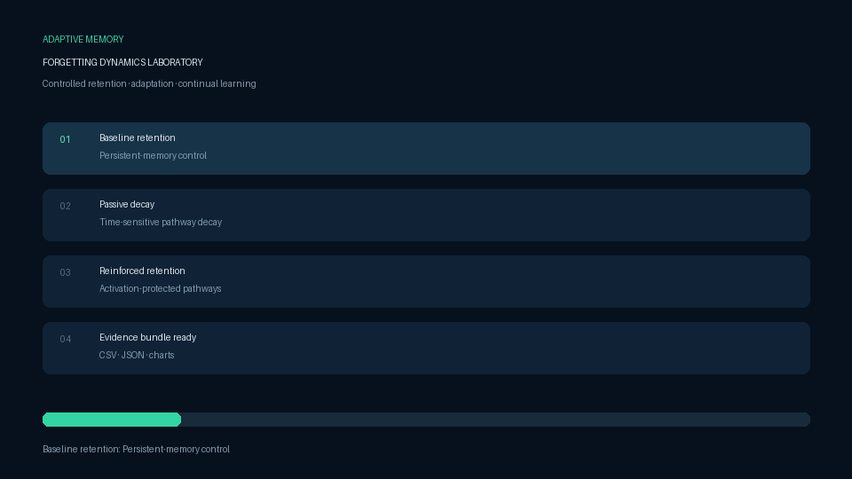

# Adaptive Memory Dynamics

**Can machine-learning systems benefit from forgetting selectively instead of retaining every pathway equally?**

Adaptive Memory Dynamics is a reproducible research framework for temporal decay, reinforcement-sensitive retention, and continual learning. It turns the capstone proposal *Human-Like Forgetting Dynamics in Machine Learning Systems* into an executable Stage One laboratory.



[Methods](docs/METHODS.md) · [Evidence guide](docs/EVIDENCE.md) · [Architecture](docs/ARCHITECTURE.md) · [Roadmap](docs/ROADMAP.md) · [Baseline results](results/stage_one_baseline/README.md)

## What is implemented

| Mechanism | Operational definition | Experimental purpose |
|---|---|---|
| Persistent baseline | Standard gradient updates; no post-update decay | Control condition |
| Passive temporal decay | All hidden pathways decay as inactivity accumulates | Tests whether indiscriminate forgetting helps |
| Reinforced retention | Frequently activated pathways receive lower effective decay | Tests selective, use-dependent memory |

The current protocol measures:

- supervised train/test accuracy and generalization gap;
- accuracy after a controlled idle-decay interval;
- Task A retention after learning disjoint Task B;
- Task B adaptation speed;
- pathway usage and model-weight dynamics;
- variance across independent random seeds.

## Run the experiment

```bash
python -m venv .venv
source .venv/bin/activate  # Windows: .venv\Scripts\activate
pip install -e ".[dev]"
python -m adaptive_memory.cli
```

Every run creates an immutable evidence bundle under `results/runs/<timestamp>/`:

```text
manifest.json              environment, protocol, and claim boundary
raw_metrics.csv            epoch-level observations
run_summary.csv            one row per mechanism and seed
accuracy_curves.png         learning progression
mechanism_comparison.png    accuracy and retention comparison
continual_forgetting.png    Task A loss after Task B
```

For a short pipeline check:

```bash
python -m adaptive_memory.cli --quick
```

## One-click research dashboard

```bash
python -m adaptive_memory.gui
```

The dashboard runs the complete mechanism × seed matrix and exports the evidence package with one button. Stop requests finish the current atomic run and safely export completed observations.

## Scientific status

The checked-in Stage One results use scikit-learn's offline 8×8 handwritten-digits dataset to validate the full protocol. They are **exploratory engineering evidence**, not a substitute for the proposal's planned MNIST, Fashion-MNIST, CIFAR-10, and sequential benchmarks. Findings remain hypotheses until replicated at the planned scale with preregistered comparisons and statistical analysis.

This boundary is deliberate: the repository separates implemented mechanisms, measured observations, and future claims.

## Development

```bash
ruff check .
pytest -q
python -m adaptive_memory.demo
```

CI tests Python 3.10 and 3.12, runs the unit suite, executes a smoke experiment, and uploads its evidence as a workflow artifact.

## Citation and license

See [CITATION.cff](CITATION.cff). Code is released under the [MIT License](LICENSE).

