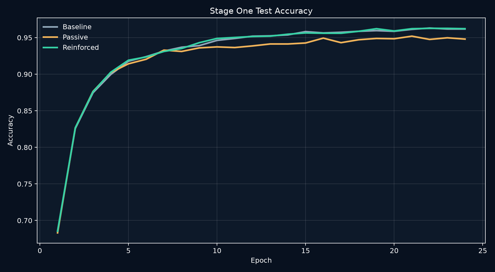
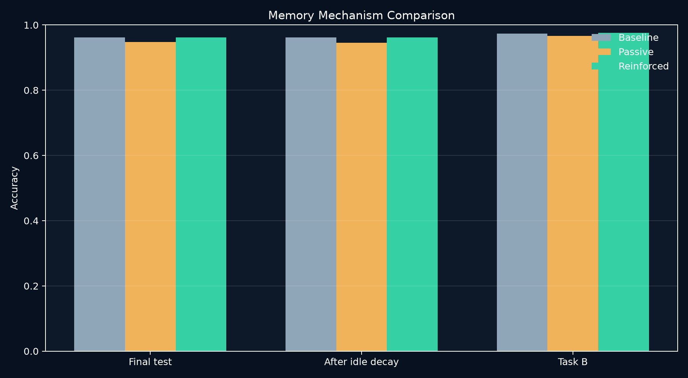
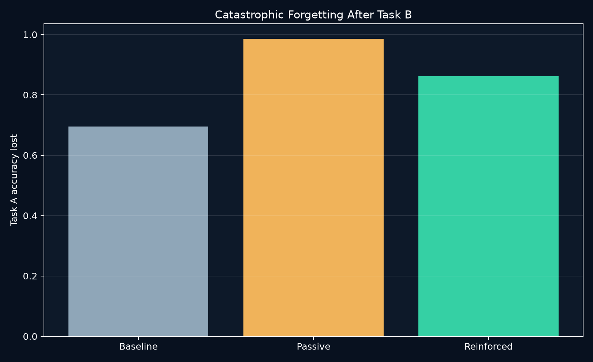

# Stage One Baseline Results

[← Project home](../../../../README.md) · [Methods](../../../../docs/METHODS.md) · [Evidence guide](../../../../docs/EVIDENCE.md)

Run ID: `2026-09-15_digits-8x8-v1`  
Generated: `2026-09-15T04:51:38.094035+00:00`  
Dataset: `sklearn-digits-8x8`  
Status: frozen exploratory baseline

This directory contains the first frozen evidence bundle generated by the repository itself. Results validate the experiment and export pipeline on `sklearn-digits-8x8`; they do not establish performance on the capstone's planned datasets.

## Frozen configuration

Five independent seeds (`7, 21, 42, 84, 101`), 24 supervised epochs, 16 epochs per continual-learning task, and identical model/training settings across mechanisms.

## Aggregate observations

Mean ± sample standard deviation across seeds:

| Mechanism | Final test accuracy | Post-idle accuracy | Task B accuracy | Task A forgetting |
|---|---:|---:|---:|---:|
| Persistent baseline | 0.9618 ± 0.0092 | 0.9618 ± 0.0092 | 0.9741 ± 0.0037 | 0.6947 ± 0.1014 |
| Passive decay | 0.9480 ± 0.0088 | 0.9458 ± 0.0051 | 0.9661 ± 0.0051 | 0.9858 ± 0.0058 |
| Reinforced retention | 0.9622 ± 0.0047 | 0.9613 ± 0.0058 | 0.9759 ± 0.0024 | 0.8619 ± 0.0558 |

## Interpretation

Reinforced retention matched the persistent control on ordinary test accuracy and Task B adaptation, while passive decay reduced accuracy. Neither decay mechanism improved Task A retention in this first sequential configuration: the persistent baseline forgot less. This mixed/negative result rejects any immediate claim that the current decay rule solves catastrophic forgetting and establishes the next experiment—rate/strength ablation with larger benchmark replication.

Download the [run summary](run_summary.csv), [raw epoch metrics](raw_metrics.csv), and [experiment manifest](manifest.json) to audit or replot the result.
