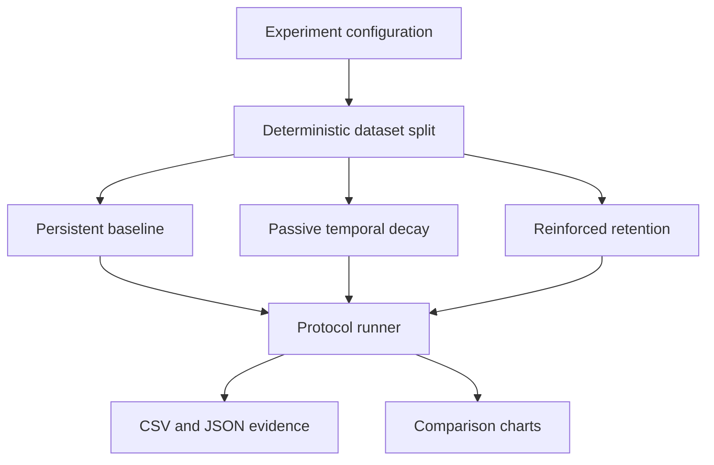

# Architecture

[← Project home](../README.md) · [Methods](METHODS.md) · [Roadmap →](ROADMAP.md)

## Module map

| Module | Responsibility |
|---|---|
| `data.py` | deterministic dataset loading and continual-task construction |
| `model.py` | transparent MLP, usage memory, and decay operators |
| `experiment.py` | controlled training, retention, continual learning, exports |
| `visualization.py` | fixed-style evidence charts |
| `cli.py` | scripted/reproducible execution |
| `gui.py` | one-click local experiment collection |
| `demo.py` | deterministic README demonstration asset |

The model and experimental protocol are deliberately separate. Future PyTorch models can implement the same mechanism contract without changing metrics, exports, or chart generation.

